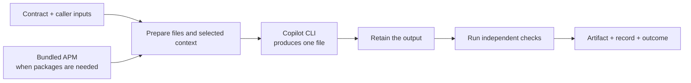

# apmx

**Run a Copilot task with declared inputs, one output file, and checks you control.**

Instead of stopping at "the agent says it's done," keep the output and a record
of what separate checks observed. APMX runs one Markdown contract through
GitHub Copilot CLI. For packaged tasks, its bundled APM prepares the dependencies
and selected context; you do not install APM separately.

[First run](#run-your-first-contract) | [Install](docs/install.md) |
[Software factory](examples/contracts/software-factory/README.md) |
[Contract examples](examples/contracts/README.md)

**Status:** private, MIT-licensed standalone project. This README describes the
current checkout. [v0.2.0 is published](https://github.com/danielmeppiel/apmx/releases/tag/v0.2.0),
but predates the newer native skill discovery, preparation logs and factory
example. Use a [matching source installation](docs/install.md#run-the-current-source-checkout)
for the full walkthrough, not just a binary with the same version string.

## Run your first contract

Turn three source notes into a `handoff.json` file with a summary and caution
for each note. The example includes the input, contract and Python checker.

Before starting, have **APMX on PATH, Git, Copilot CLI, and Python 3.12+**
available. Authenticate Copilot before live execution. Repository access is needed to obtain this private
checkout. The [installation guide](docs/install.md) covers native archives,
current source, and platform prerequisites.

**Run only contracts you trust.** Execution uses your host files, network and
available login details; it is not sandboxed. The example uses a fresh caller
outside the checkout. Do not remove a real project's remotes or policy to make
it eligible.

From this checkout's root, on macOS or Linux:

```sh
caller="$(mktemp -d "${TMPDIR:-/tmp}/apmx-first.XXXXXX")" &&
cp -R examples/contracts/first-contract/. "$caller/" &&
cd "$caller" &&
apmx handoff.contract.md --on copilot --plan
```

The preview lists `notes.md`, `handoff.json` and the `handoff` check. Nothing
executes or downloads. Copilot must be discoverable, but preview success does
not validate its login, run checker tools or prove that output can be produced.
If the preview succeeds and you are ready for host execution, run the same contract:

```sh
apmx handoff.contract.md --on copilot --allow-host-access
```

This uses your configured Copilot model and may incur usage charges. Add
`--model MODEL` only to select a model explicitly. For PowerShell, use the
[Windows first-run commands](docs/install.md#windows-first-run).

The important result lines from a completed run are shown below.
Output is abbreviated; the run ID is a placeholder:

```text
apmx: checking handoff.json
  [+] handoff: passed

[!] apmx: UNPROVEN
  Contract checks passed; this run was not sandboxed.
  Output: .apm/runs/<run-id>/artifacts/handoff.json
  Record: .apm/runs/<run-id>/record.json
```

**Open the printed Output and Record paths.** They are relative to your caller
directory. Nothing is copied back over a caller-root `handoff.json`.
The checker confirms JSON shape and source-ID coverage, not complete factual
correctness of the summaries.

**Exit 21 is expected here:** the checks passed, but this native run is not sandboxed.
Do not treat every 21 as success; missing output or incomplete checks also
produce 21. Read the check results and the [exit-code explanation](#understand-the-result).

## What a contract contains

A `.contract.md` file combines a small YAML header with the task instructions.
For example, using the notes and checker from the walkthrough:

```markdown
---
needs: notes.md
produces: handoff.json
verify:
  handoff: python3 checks/check_handoff.py handoff.json notes.md
---
Read notes.md and write a JSON array to handoff.json.
Include one object per source ID, with nonempty source_id, summary and caution.
Explain each fact plainly and name its limitation. Do not invent facts.
```

| Part | Responsibility |
| --- | --- |
| `needs` | Files supplied by the **caller**, not a package's example data. |
| `produces` | The **one file** to retain and assess. |
| `verify` | Named commands run against that retained output in separate check workspaces. |
| Body | What Copilot should do; not permission to skip the checks. |

The task's author chooses the checks. A passing command establishes only what
that check actually tests, not everything the agent claims.

## How APMX, APM and Copilot fit together



APM owns package installation and resolution. Copilot does the agent work.
APMX selects the contract, captures inputs and checker resources, supervises
execution, and records the assessed output's identity and check results.
It does not apply a patch, commit, merge or deploy the result for you.

For reuse, `--from PACKAGE_REF` selects a package-owned contract and checks.
Optional `imports` select **APM package names**; their versions belong in
`apm.yml` and the caller's lock, not the contract's `imports` list.
Caller manifests and locks remain unchanged during temporary preparation.

In the current checkout, selected skills are discovered natively from
`.agents/skills/<skill-name>/`; their bodies are not pasted into the prompt.
`Imported ...` reports preparation. `Copilot > Loaded skill: ...` reports an
observed native load, not a passed check. Add `--verbose` for APM diagnostics
and detailed run observations.

[Run the packaged handoff](examples/contracts/packaged-job/README.md) to see
bundled APM and a selected skill in action. For lock, context and platform
details, see [runtime boundaries](docs/source-origin.md).

## Chain an AI-native software lifecycle

The [software-factory example](examples/contracts/software-factory/README.md)
builds a small Python shipping-cost library through separate contracts:

```text
Planning -> Specification -> Build -> Test -> Review
 plan.json     spec.json     shipping.py  tests.json  review.json
```

An ordinary Python driver owns the sequence. It gives each phase a fresh caller,
admits only consistent records with passing required checks, and copies the
exact retained artifact bytes into the next phase's inputs. Failed or incomplete
phases stop the chain; generated tests and AI review cannot certify their own
success.

This is composition **outside** APMX, not a built-in workflow engine. The
completed example remains `UNPROVEN`. The driver has no deployment or merge
step. Its accompanying guide covers the command, phase checks, cost
implications and result inspection.

## Understand the result

| Exit | Meaning | Next action |
| --- | --- | --- |
| `0` | Help, version or completed preview; **not** verified execution. | Continue from a successful preview when ready. |
| `2` | CLI usage error. | Check `apmx --help` and correct the invocation. |
| `20` | **REJECTED:** an independent check failed. | Inspect the output and failed check before revising the job. |
| `21` | **UNPROVEN:** passing native checks, or missing output, incomplete checks or unsupported assurance. | Inspect the check results and remaining limits; never accept 21 alone. |
| `22` | **HALTED:** operational failure, cancellation or unconfirmed cleanup. | Resolve the reported failure or cleanup problem before retrying. |

Native execution currently cannot produce a certified `VERIFIED` result.
Tool restrictions and separate workspaces are not a sandbox. Records are
same-user local observations, not protected or signed evidence; log redaction
is best-effort. Configured, disabled or unresolved remote governance is
unsupported and refuses admission rather than bypassing policy.

There is no CLI `--json` option. Each admitted run retains a JSON record under
the caller's `.apm/runs/` directory. Inspect that record rather than treating
the agent's narration or process exit zero as an assessment.

## Develop and contribute

Authorized collaborators can [report a problem or discuss a change](https://github.com/danielmeppiel/apmx/issues).
Include the release or source commit, OS, a minimal secret-free contract,
expected behavior and observed exit/check results. Review and redact logs
before sharing them; do not upload credentials or private project inputs.

After [setting up the current source and its APM backend](docs/install.md#run-the-current-source-checkout):

```sh
uv sync --frozen --extra dev --extra build
uv run --frozen --extra dev --extra build python -m pytest tests/unit tests/release -q
uv run --frozen --extra dev --extra build ruff check src/ tests/
```

Protocol fixtures do not perform live model inference. Keep live runs explicit
and distinguish them from deterministic tests.

APMX is an independent MIT-licensed extraction from Microsoft APM, not an
official Microsoft standalone release. [Source origin](docs/source-origin.md) |
[License](LICENSE) | [Notices](NOTICE)
