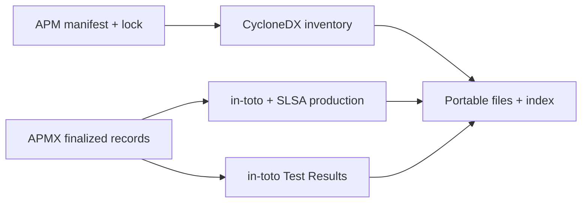

# Receipts: portable execution evidence

Every COMPLETE contract, factory or repair controller exports a standards-based
**receipt**, with or without APM dependencies. *Outputs* are the delivered
files; the *receipt* is the standards bundle that binds them to the factory,
its ingredients and its checks. When APM dependencies were installed, APM
provides the dependency inventory; APMX projects recorded production and
checker observations. The export neither runs a model nor reruns checks.
REJECTED and HALTED runs get no receipt: a receipt attests a COMPLETE result
only. Their saved attempt outputs and check logs stay under `.apm/runs/<id>/`.



## What to inspect

| File | Question it answers |
| --- | --- |
| `summary.md` | Which attempts completed or were rejected? Where are the standard files? |
| `definition.json` | Which contracts, checks, resources, capabilities and budgets defined this invocation? |
| `abom.cdx.json` | Which packages did the recorded official APM lock inventory? Zero components when no APM dependencies were installed. |
| `provenance.intoto.json` | Which selected output files did this completed invocation produce? |
| `provenance/*.intoto.json` | Which individual attempt produced each artifact, including separate code and documentation patches? |
| `checks/*.intoto.json` | What did each actual checker invocation report, against which exact files? |
| `attempts/`, `candidates/` | What retained inputs, outputs and reconstructed tested files bind those claims? |
| `index.json` | What files and hashes belong to this package? |

The CLI prints the receipt and summary paths. Receipts live next to the completed
root record: `.apm/runs/<id>/receipt`, `.apm/controllers/<id>/receipt`, or
`.apm/chains/<id>/receipt`. A completed repair includes its earlier rejected
attempts, not just the selected output. A stopped root is not eligible.

Without a retained APM lock (no APM dependencies were installed or selected),
`abom.cdx.json` is still a schema-valid CycloneDX 1.5 document. It lists zero
components and says so explicitly in `metadata.properties`
(`apmx:apm-dependencies` = `0`); `definition.json` has no resolved
dependencies and `capability-bindings.json` is empty. A run that selected
capabilities without a retained lock refuses export rather than claiming zero
dependencies. With a retained lock, missing/inconsistent inventory, ambiguous
capability bindings or unavailable checked subjects are explicit delivery
failures, not a silent downgrade. The command exits **23** while its canonical
execution record remains COMPLETE. Other execution exits are unchanged;
`--plan` never exports. See [execution outcomes](results.md).

One observed APM 0.30.0 limitation is overlapping direct and transitive local
references: the official export can contain duplicate components with the same
`bom-ref`. CycloneDX rejects the duplicate inventory. APMX reports delivery
failure rather than deduplicating the official bytes or relabeling execution.

## Standards and their scope

| Content | Published format |
| --- | --- |
| Official APM inventory | CycloneDX JSON 1.5 |
| Every production/check statement | `https://in-toto.io/Statement/v1` |
| Production predicate | `https://slsa.dev/provenance/v1` |
| Check predicate | `https://in-toto.io/attestation/test-result/v0.1` |

APMX's small `apmx-evidence-package/1` index and `apmx-definition/1` definition
connect these standard files; they do not replace their formats. The index
profile name predates the *receipt* vocabulary and is kept for compatibility.

### Contract v1 build-type mapping

The build-type identifier is
`https://github.com/danielmeppiel/apmx/build/contract/v1`. This section defines
its development mapping; that identifier is not a claim of a separately
published service or registered standard.

Each producer statement names its exact output bytes as subjects. Its
`buildDefinition.externalParameters` binds the normalized definition and
retained contract digest. `resolvedDependencies` names the actual retained
source and baseline files. `runDetails` records the builder identifier
`https://github.com/danielmeppiel/apmx`, harness and observed times. The ABOM and
execution projection are **byproducts**, not inputs supposedly read by a model.
An aggregate statement relates selected outputs to distinct producer statements.

With dependencies, APM's export is retained verbatim, without installing or
re-resolving dependencies.
Its deterministic inventory timestamp is not an execution time. Its coarse
package identifiers do not always identify a virtual skill. Therefore
`capability-bindings.json` connects an unambiguous official component to the
retained lock, selected skill body, resources and verified package hash.
Unknown or ambiguous mappings refuse export rather than inventing components.

The definition includes exact contract bytes, declared checks, checker resources,
selected capability content/pins, limits, repair budget and normalized resolved
dependencies. It excludes harness, requested/observed model, clocks, executable
and temporary checkout locations. Changing those observations does not change
the definition fingerprint; changing the goal, check resources or pins does.
This is an exact definition identity, not semantic equivalence between prompts.

All file identities are SHA-256 over actual bytes. Definition JSON is sorted,
compact ASCII with a final LF. The example checker's candidate-tree digest is
different: SHA-256 over its sorted compact ASCII inventory JSON **without LF**.
It is not the hash of `changes.diff`, a workspace digest, or the ordinary
LF-terminated inventory file.

### Check statements

Generic checks report the whole invocation over declared artifacts, without
invented per-test names. The versioned software-factory checker profiles bind
document checks to the specific document and behavior checks to the reconstructed
candidate files. Combined-candidate checks include both code and documentation
patches; their producers remain separate.

Reports must come from the retained logger's exact checker/stdout attribution.
LF and Windows CRLF line endings delimit reports identically; embedded control
characters remain visibly escaped. This does not normalize source or artifact bytes.
Producer text or similarly named checkers cannot supply them. Missing, truncated,
duplicate or unsupported reports refuse export for known example checkers.
Per-test observations are copied only when explicitly reported. Document gates
establish their stated format/reference/example scope, not prose correctness.

## Export again without inference

Use the development Python environment and, when the run had APM dependencies,
the exact recorded official APM backend. Supply an original completed root
record and a **new** destination:

```sh
.venv/bin/python - /absolute/path/to/record.json /absolute/path/to/new-receipt <<'PY'
import sys
from pathlib import Path
from apmx.contracts.evidence import export_package

print(export_package(Path(sys.argv[1]), Path(sys.argv[2])))
PY
```

This validates canonical retained evidence and reconstructs checked candidates
in owned temporary directories, without executing their code. It refuses
existing/symlink destinations, checks all written bytes, revalidates the root,
and publishes a completed directory by rename. It does not rewrite canonical
records. The export has a 512 MiB byte bound. Raw records themselves still
refer to original local evidence paths; relocate the **exported receipt**.

## Verify a receipt: `apmx audit`

```sh
apmx audit .apm/chains/<id>/receipt
```

[`apmx audit`](audit.md) is the primary verifier. It reports Integrity,
Standards, Factory, Checks, Ingredients, Outputs and Identity rows, delegates
dependency trust to the bundled APM (`apm install --frozen` + `apm audit --ci`)
and ends with `VALID (content-bound; not authenticated)` or `INVALID` and the
first reason. The pinned CycloneDX schemas ship inside apmx, so structural
verification works offline.

## Independent, offline verification

The single verifier lives in `src/apmx/audit/verifier.py`. It imports only the
standard library and pinned upstream in-toto protobuf bindings, protobuf and
jsonschema. `scripts/verify_evidence.py` is a thin wrapper that loads it **by
file path**, so it does **not** import APMX. From the source checkout:

```sh
python3 -m venv .venv-evidence
.venv-evidence/bin/python -m pip install -r scripts/evidence-requirements.txt
.venv-evidence/bin/python scripts/verify_evidence.py /path/to/receipt --require-capability
.venv-evidence/bin/python scripts/check_evidence_controls.py /path/to/receipt \
  --schemas src/apmx/audit/schemas
```

Environment installation requires network access. Validation is offline and
uses the hash-pinned schemas bundled in `src/apmx/audit/schemas/` unless you
pass `--schemas DIR` (add `--fetch-schemas` to download the same pinned bytes
into `DIR`). Schema hashes and source commit pins are checked; use `--help` for
the complete interface.
`--require-capability` is a demonstration gate for an actual selected capability,
not a requirement for all possible inventories.

Published syntax validation alone is insufficient: protobuf bindings accept
some omitted fields and arbitrary result strings. The script additionally checks
this documented profile's required fields, counts, actual subjects, resource
digests, definition bindings and check observations. It rejects symlinks,
unindexed files and unsupported predicates. The controls script verifies a
relocated copy, then corrupts bytes, references, subjects, results, builder,
predicate and check membership. Semantic controls refresh index hashes so they
cannot pass by testing only stale checksums. Originals are unchanged.

## What this does not guarantee

These are **unsigned, same-user local observations**. They provide inspectability
and content binding, not an authenticated signer, SLSA security level, sandbox,
independent witness, general software correctness or permission to merge/deploy.
A person who can rewrite every file and hash can forge a self-consistent package.

Raw transcripts, raw canonical records and repair diagnostic excerpts are omitted.
Project baselines, capability resources, source manifests and locks are included
verbatim and can contain private code, paths or secrets. **Review before sharing**;
this is not a general redaction tool. The MVP does not add governed execution.
