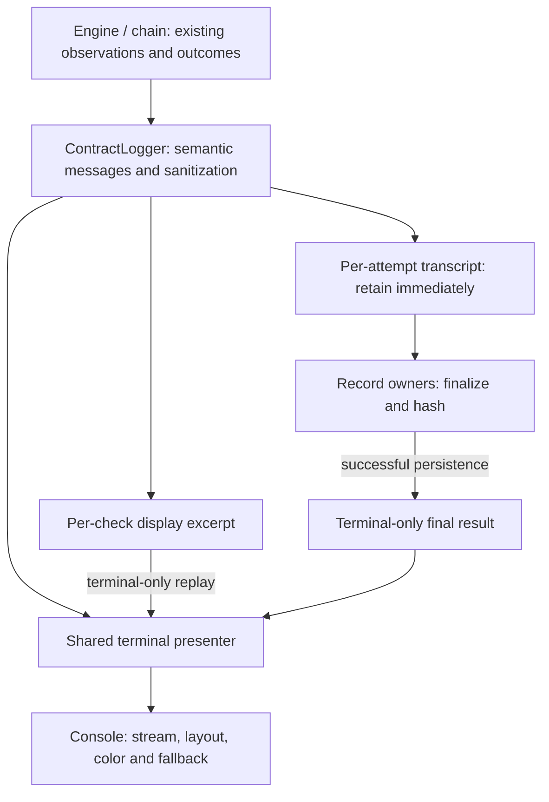

# Terminal output

Use a [matching current-source build](install.md#choose-release-or-current-source)
for these presentation behaviors.

Default output emphasizes the work, check results and saved artifacts. For
diagnostic detail, run:

```sh
apmx ./feature-factory --on copilot --verbose
```

Verbose output includes eligible tool activity, checker evidence and process
details beneath the corresponding status rows. It does not expose private
reasoning or turn retained-only protocol events into public messages.

## Reading the output

Contract headings and result blocks have clear blank-line boundaries.
Headings/activity use cyan; metadata is subordinate. Both modes show actual
output names under Produces, engine-owned PASS/FAIL under Checks, and final
counts plus copyable artifact-directory and record paths under Evidence.

Before interactive factory consent, the work preview lists contract, artifact
and planned-check counts, then every contract's Produces and Checks names.
Contract identities match execution: a unique basename, or a root-relative
path when names collide. Full source paths, input provenance and check commands
are verbose detail. No check result is claimed before execution, and Evidence
says where it **will be saved**, not that a record already exists.

The local-access, package-installation and cost disclosure follows the work
preview exactly once, immediately before `Run these 4 contracts with Copilot?
[y/N]` (or `Run this contract with Copilot? [y/N]` for one contract). The default
is no; declining starts no package, model or check work. Headings are cyan,
context and the prompt are neutral, and no success or warning color precedes
execution. `--plan` shows the same work hierarchy and the selected handoff policy,
without execution disclosure or a consent prompt. Explicit consent flags still
disclose local execution before action.

| Indicator | Meaning |
| --- | --- |
| Cyan `[>]` | Work in progress |
| Green `[+]` | An engine-owned PASS check or finalized COMPLETE result |
| Yellow `[!]` | UNPROVEN or incomplete work, including declined consent |
| Red `[x]` | Failure, rejection or halted execution |

Words and ASCII indicators carry the meaning even without color. A completed
native factory returns **COMPLETE / exit 0** in v0.4.0 source and downloads, only after
validated durable finalization. The local-access/cost disclosure appears once
before consent/action, not as repeated per-leaf warnings. Green results do not
imply isolation, correct software or production certification. Historical
v0.3.2 and its recordings retain UNPROVEN/21; see [migration](results.md).

Routine model narration, tool activity and passing checker stdout belong in verbose output.
Default output still shows stderr and explicit diagnostics. A failed or
incomplete check shows its normalized result and a bounded stdout excerpt;
the saved transcript provides the retained detail. Check output is evidence
from an external program, not the authority for a green or red status.

An interactive `NO_COLOR` terminal keeps hanging indentation without ANSI.
Redirected output keeps logical lines, without animation or application-inserted
wrapping. Saved artifact and record paths stay intact and copyable. The existing
ASCII, redaction, literal-text and broken-pipe protections apply in every mode.
Output supports LF and native Windows CRLF line endings; a lone carriage return
from an external message is escaped rather than used to move the cursor.

## Ownership for maintainers

The design uses composition, not a second logging framework.

| Concern | Owner |
| --- | --- |
| Outcomes, normalized check results and handoff admission | Existing engine, records and chain owners |
| Semantic explanations and observation routing | `ContractLogger` in `core/contract_logger.py` |
| Roles, visibility, indentation, block gaps and outcome emphasis | Its private `_ContractDisplay` |
| Per-check pending stdout and diagnostic excerpts | Its private `_CheckEvidence` |
| Stream capabilities, width, literal rendering and fallback | `utils/console.py` |
| Bounded retained evidence | Existing per-attempt `_Transcript` and record finalization |

Factory and leaf loggers explicitly share terminal presentation state, not
transcripts, check buffers, outcomes or completion counters. Each leaf receives
its step context explicitly. This matches the current sequential execution
model; it is not a claim that the logger supports concurrent task scheduling.



Sanitize and retain observations before selecting what to display. Human
indentation, buffering and suppression must not rewrite or duplicate retained
evidence. Excerpt replay and final summaries are terminal-only; they must not
append to a finalized transcript.

Pending stdout and displayed excerpts have separate byte and logical-line
bounds. A flood, including one oversized line, cannot create an unbounded
buffer. Each buffer belongs to one check and is cleared at completion or close.
Output without a completed observation is labeled as such, not inferred to be
a failed or passing check. Stderr stays immediately visible and is not replayed
as duplicate buffered evidence.

Visibility is independent of visual role: dim does not mean verbose-only.
Terminal layout, ANSI permission and animation eligibility are separate
capabilities. Progress preferences remain owned by the existing progress
policy; forcing progress must not defeat terminal safety exclusions.

Recovery handles only expected rendering failures and reports a diagnostic
without exception contents. I/O and programming errors propagate rather than
replaying potentially partial output.

## Extending the presentation

- Add semantic logger methods rather than `print`, `click.echo`, color strings
  or blank-line writes in command and execution code.
- Reuse the presenter's role and outcome policy. Never derive severity from
  checker JSON, raw status text or a second outcome reducer.
- Use a visible block boundary rather than counting newlines across callers.
  Hidden observations must not add gaps or suppress human liveness updates.
- Derive summary counts only from observations whose meaning the execution
  owner establishes. A returned leaf that failed admission is not a completed
  factory step.
- Keep source paths literal and external payloads attributed. Do not promote
  an external program's success claim into an engine verdict.

Behavioral logger/factory regressions cover the visible behavior and evidence
boundary. `tests/unit/test_terminal_architecture.py` supplies the complementary
AST guard for dependency direction, terminal-write ownership, styling,
capability detection and presentation side effects. The normal standalone CI
test suite discovers it on every platform; no separate APM registry or linter
framework is required.
