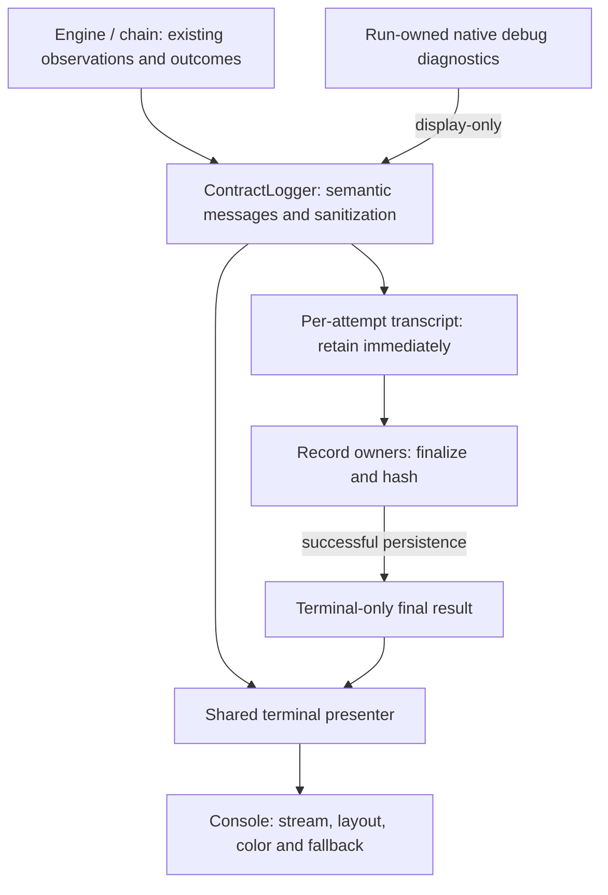

# Terminal output

Use a [matching current-source build](install.md#choose-release-or-current-source)
for these presentation behaviors.

Default output tells one story per run: each contract's inputs and outputs,
its agent loop until the checks pass, the factory order and file handoffs, and
a final block naming the outputs and the receipt.

```text
Factory  factory   2 contracts   copilot / fixture-model

[1/2] first    needs notes.md -> produces first.json, second.json
      attempt 1/1  agent 4.0s   checks: [+] identity
      [+] first.json, second.json -> handed to second

[2/2] second   needs notes.md, first.json, second.json -> produces final.json
      attempt 1/1  agent 3.0s   checks: [+] identity
      [+] final.json

[+] COMPLETE   2/2 contracts   2/2 checks   9.0s

Outputs   factory/.apm/chains/<id>/artifacts/
          first.json  second.json  final.json
Receipt   factory/.apm/chains/<id>/receipt/
          provenance  in-toto + SLSA v1
          checks      in-toto test-result (2)
          inventory   CycloneDX 1.5 (0 components)
          unsigned: binds content, not identity; review before sharing

Next      apmx audit factory/.apm/chains/<id>/receipt
```

When checks reject an output, the block shows every attempt, the last lines
of the failing check's output, contracts that never started, and what to do:

```text
[1/2] first    needs notes.md -> produces first.json, second.json   budget 3 attempts
      attempt 1/3  agent 5.0s   checks: [x] identity
      attempt 2/3  agent 4.0s   checks: [x] identity
      attempt 3/3  agent 4.0s   checks: [x] identity
        identity: Independent fixture check: reject

[2/2] second   not started: waits on first

[x] REJECTED   first failed check identity after 3/3 attempts   exit 20

Saved     factory/.apm/runs/<id>/   (attempt files + logs)
Next      Fix the contract or check, then rerun:  apmx ./factory
          More detail:                            apmx ./factory --verbose
```

A single `.contract.md` uses the same shape without `[i/N]` order or handoff
lines. The Receipt rows name only standards documents that the export actually
wrote; without a receipt the block ends at Outputs. `Next` suggests
`apmx audit` only in builds that ship it.

`--verbose` keeps everything else, in order and indented under its contract:
capture details (`Found input`, `Working copy`), phase lines, agent narration,
tool calls, check commands and checker output, per-check PASS/FAIL lines,
record and log paths, and the receipt's individual files.

```sh
apmx ./feature-factory --on copilot --verbose
```

Copilot producers run with `--log-level all` in a private, per-attempt log
directory. OpenCode producers use `--print-logs --log-level DEBUG`.
`--verbose` also mirrors these native debug diagnostics live.
Configuration/authentication inventory probes remain quiet. Public JSON event
decoders still exclude private reasoning and retained-only protocol events.
Native debug diagnostics are less structured and may contain sensitive native
metadata: redaction is best-effort, not a safe-to-project-or-publish guarantee.

## Reading the output

Contract blocks and the final block have clear blank-line boundaries. `attempt
n/N` counts the engine's attempts against the authored budget (`1/1` when no
budget is authored). Its `[+]`, `[x]` and `[!]` marks are the engine-owned
PASS, FAIL and INCOMPLETE verdicts. A handoff line is printed only after the
factory admitted the producer's files for the next contract.

On an interactive, color-capable terminal, the running attempt is one line
updated in place with elapsed agent time and the agent's latest status. When
output is redirected, in CI, with `NO_COLOR` or `TERM=dumb`, output is
append-only: no cursor control, completed lines only, and a sparse
`still running` line during long quiet work. Native stderr and engine
diagnostics remain immediately visible in every mode.

Before interactive factory consent, the work preview lists contract, artifact
and planned-check counts, then every contract's Produces and Checks names.
Contract identities match execution: a unique basename, or a root-relative
path when names collide. Required files are visible in both modes, distinguished
as starting inputs or earlier-stage outputs. During execution, `--verbose` emits
`Found input` only after the canonical workspace owner captures the actual file,
with its origin, byte count, SHA-256 and upstream record, and shows each
check's name and command before it starts. No check result is
claimed before execution, and Evidence
says where it **will be saved**, not that a record already exists.

The local-access, package-installation and cost disclosure follows the work
preview exactly once, immediately before `Run these 4 contracts with Copilot?
[y/N]` (or `Run this contract with Copilot? [y/N]` for one contract). The default
is no; declining a local factory starts no package, model or check work. Headings are cyan,
context and the prompt are neutral, and no success or warning color precedes
execution. `--plan` shows the same work hierarchy and the selected handoff policy,
without execution disclosure or a consent prompt. Explicit consent flags still
disclose local execution before action.

With `--from`, an interactive factory first explains the temporary workspace,
APM dependency installation and possible network/login use, then asks
`Load this factory and install its dependencies? [y/N]`. Accepting authorizes only loading;
the resulting work preview still needs a separate execution confirmation. Decline
the first prompt to prevent acquisition, or the second to prevent agents and checks
from starting. Neither prompt grants policy exceptions. Noninteractive runs still
require explicit consent flags; packaged single-contract runs are unchanged.

| Indicator | Meaning |
| --- | --- |
| Cyan `[>]` | Work in progress |
| Green `[+]` | An engine-owned PASS check or finalized COMPLETE result |
| Yellow `[!]` | UNPROVEN or incomplete work, including declined consent |
| Red `[x]` | Failure, rejection or halted execution |

Words and ASCII indicators carry the meaning even without color. A completed
native factory returns **COMPLETE / exit 0** in v0.4.2 source and downloads, only after
validated durable finalization. The local-access/cost disclosure appears once
before consent/action, not as repeated per-leaf warnings. Green results do not
imply isolation, correct software or production certification. Historical
v0.3.2 and its recordings retain UNPROVEN/21; see [migration](results.md).

Agent narration, tool activity and checker output are `--verbose` detail. A
failed or incomplete check adds the last five lines of its output (stdout and
stderr) under the attempt in default mode; `--verbose` does not replay
already-streamed lines. Check output is evidence
from an external program, not the authority for a green or red status.
Checker stdout retains sanitized logical lines up to the existing 16 KiB stream
limit; the terminal uses the same bound for checker lines. This keeps bounded JSON
subject reports usable for evidence delivery. The total transcript budget,
redaction and refusal of missing or malformed reports remain unchanged.

Native debug noise is displayed separately from the evidence transcript so it
cannot consume the space needed by checker subject reports. Copilot's native
files remain under the attempt's `native-tools/copilot-logs/`, outside the portable
receipt. Only ordinary `.log` files in that run-owned directory are
mirrored, with eight-file, 8 MiB and 16 KiB line bounds and explicit omission
notices. Global logs, links, special files and configuration files are not read.
OpenCode INFO/DEBUG stderr is similarly display-only; warnings/errors retain
the normal diagnostic path. Neither stream can decide a run or check outcome.

`budget 3 attempts` describes the authored execution/check limit, not a model
spending cap. `attempt 1/3` does not imply a retry happened. `--verbose` adds
the full bound (`Attempts: up to 3 ... 600s total`) and `Accepted on attempt 1`.

After automatic delivery, `Receipt` names the actual `receipt/` directory and the
standards documents it contains; `--verbose` adds each file, including the
factory definition and the SHA-256 file index. Hashes bind the recorded bytes;
the receipt is unsigned and does not authenticate the builder. See
[evidence verification](evidence.md) and the [live demo](demo.md).

An interactive `NO_COLOR` terminal keeps hanging indentation without ANSI.
Redirected output keeps logical lines, without animation or application-inserted
wrapping. Terminal rows wrap only between words, so output, receipt and saved
paths and the suggested commands stay intact and copyable. The existing
ASCII, redaction, literal-text and broken-pipe protections apply in every mode.
If capturing terminal output yourself, write the log outside the application:
a changing log inside the application can invalidate its admitted input snapshot.
Output supports LF and native Windows CRLF line endings; a lone carriage return
from an external message is escaped rather than used to move the cursor.

## Ownership for maintainers

The design uses composition, not a second logging framework.

| Concern | Owner |
| --- | --- |
| Outcomes, normalized check results and handoff admission | Existing engine, records and chain owners |
| Semantic explanations and observation routing | `ContractLogger` in `core/contract_logger.py` |
| Roles, visibility, indentation, block gaps and outcome emphasis | Its private `_ContractDisplay` |
| Pending check identity and completion observation | Its private `_CheckEvidence` |
| Attempt lines, handoff lines and the final block | Its display-only `_AttemptView`, `_LeafView` and `_FactoryView` |
| Stream capabilities, width, literal rendering and fallback | `utils/console.py` |
| Bounded retained evidence | Existing per-attempt `_Transcript` and record finalization |

Factory and leaf loggers explicitly share terminal presentation state, not
transcripts, check buffers, outcomes or completion counters. Each leaf receives
its step context explicitly. This matches the current sequential execution
model; it is not a claim that the logger supports concurrent task scheduling.


```mermaid
flowchart TD
    E["Engine / chain: existing observations and outcomes"] --> L["ContractLogger: semantic messages and sanitization"]
    L --> T["Per-attempt transcript: retain immediately"]
    L --> D["Shared terminal presenter"]
    N["Run-owned native debug diagnostics"] -->|"display-only"| L
    D --> C["Console: stream, layout, color and fallback"]
    T --> R["Record owners: finalize and hash"]
    R -->|"successful persistence"| F["Terminal-only final result"]
    F --> D
```

Sanitize and retain observations before selecting what to display. Human
indentation, buffering and suppression must not rewrite or duplicate retained
evidence. Native debug display and final summaries are terminal-only; they must not
append to a finalized transcript.

Stream framing and retained transcripts have explicit bounds. A flood, including
one oversized line, cannot create an unbounded buffer. Pending check state
belongs to one check and is cleared at completion or close.
Output without a completed observation is labeled as such, not inferred to be
a failed or passing check. Stderr stays immediately visible and is not replayed
as duplicate buffered evidence.

Visibility is independent of visual role: dim does not mean verbose-only.
Terminal layout, ANSI permission and animation eligibility are separate
capabilities. Progress preferences remain owned by the existing progress
policy; forcing progress must not defeat terminal safety exclusions.

Recovery handles only expected rendering failures and reports a diagnostic
without exception contents. I/O and programming errors propagate rather than
replaying potentially partial output.

## Extending the presentation

- Add semantic logger methods rather than `print`, `click.echo`, color strings
  or blank-line writes in command and execution code.
- Reuse the presenter's role and outcome policy. Never derive severity from
  checker JSON, raw status text or a second outcome reducer.
- Use a visible block boundary rather than counting newlines across callers.
  Hidden observations must not add gaps or suppress human liveness updates.
- Derive summary counts only from observations whose meaning the execution
  owner establishes. A returned leaf that failed admission is not a completed
  factory step.
- Keep source paths literal and external payloads attributed. Do not promote
  an external program's success claim into an engine verdict.

Behavioral logger/factory regressions cover the visible behavior and evidence
boundary. `tests/unit/test_terminal_architecture.py` supplies the complementary
AST guard for dependency direction, terminal-write ownership, styling,
capability detection and presentation side effects. The normal standalone CI
test suite discovers it on every platform; no separate APM registry or linter
framework is required.
