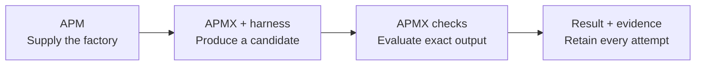
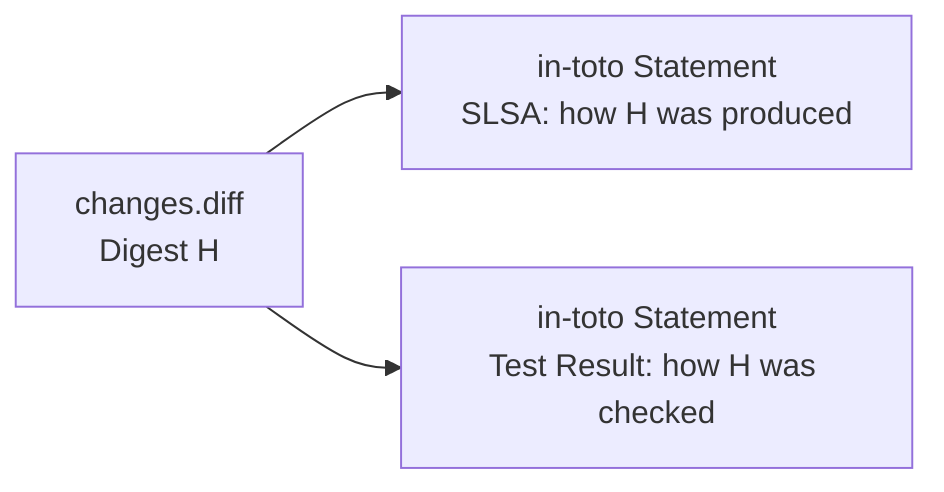

# Version Your Factory, Not Just Your Code

## You did not start by building a factory

You started by getting useful work out of an agent. You explained the repository, described the task and corrected the result. Then you found yourself explaining the same method again.

So you captured it as a skill. Architecture, security and testing expertise became shared capabilities that both Build and Review could use. Packaging them as plugins let another agent or team reuse the method.

The next repetition was feedback: build, check, review, correct. Automating that return path turned conversations into bounded loops. Connecting those loops across design, implementation and review created something bigger than a prompt collection: a producing system with shared capabilities, workflows and acceptance rules.

That is the Agentic Software Factory. Engineers still set intent, judge outcomes and use the product. They also maintain the system that produces it.

> Version your factory so you can govern what runs, verify what it produces, and preserve the evidence.

## Automation moves the bottleneck

Producing more changes does not automatically increase the capacity to validate them. Human review remains scarce. CI still takes time. A confident explanation does not establish that a change preserves the architecture or satisfies a security requirement.

The response is not simply another reviewer. Turn recurring failures into executable requirements: architectural boundaries, behavioral scenarios, security and dependency-policy checks. Give agents fast feedback without weakening the independently controlled outer gate.

**Generation proposes. Verification evaluates. Policy authorizes.** A passing test is not permission to merge, and merge permission does not authorize deployment. Policy-authorized auto-merge makes these distinctions more important, not less.

## The producer has a supply chain

Instructions, skills, plugins and MCP tool services are dependencies of the producing system, even when they never appear in the application's dependency manifest. Some come from third parties with uneven maintenance and trust. Compromise a shared component and you can influence many subsequent changes.

Malice is not required. Models can be confidently wrong or obtain misleading green results by weakening tests and baselines. Legitimate tests must evolve, but the producer must not silently redefine success and approve itself.

After an incident, a diff and a chat transcript leave important questions unanswered: **Which factory version produced this? Which checks evaluated it? Which other outputs are associated with the suspect component?**

Security, controlled change and auditability depend on answering those questions. They are not reporting features to add later.

## Apply familiar engineering to the authoring system

We already know how to maintain shared software: give modules versions, dependencies, owners, tests and release notes. Review upgrades. Preserve compatible interfaces. Keep a rollback path. The same discipline belongs around the capabilities that write our code.

**APM** brings that package-manager model to reusable agent instructions and resources: resolve dependencies, lock versions, distribute capabilities and export inventory. Teams can maintain a shared catalog rather than copy expertise into every workflow.

**Agent Plugins 1.0** supplies a common packaging format for skills and MCP configuration in compatible clients. It is a starting point, not a factory specification: permissions, credentials and orchestration still need runtime or platform support.

The proposed model connects packaging to a defined job and its evidence:

| Part | Its job |
| --- | --- |
| **APM** | Supply the selected, versioned capabilities and their dependency inventory. |
| **Agent Contract** | Define the goal, inputs, outputs, selected capabilities, required checks and limits. |
| **First-class Checks** | Keep acceptance criteria as named, versioned code and configuration. |
| **APMX** | Run the agreement through a supported harness, check candidates and manage bounded repair. |
| **Evidence Package** | Preserve what was supplied, what ran, what was produced and how it was checked. |

A contract can be a Markdown file with referenced resources, packaged through APM. It need not become a new authoring burden: an agent can help draft it. What matters is that the agreement is explicit before execution.

## From a packaged agreement to a recorded job

The harness runs the producing conversation. APMX manages the job around it. This is the forward path of the proposed model; repair repeats production and checking under the same agreement.

First, APMX prepares capabilities through APM and captures the agreement, original inputs and checker versions. It then invokes the chosen harness. The harness returns a candidate, not an authoritative declaration of success.

APMX captures the output and runs the retained checks outside the producing conversation. A failure can become repair feedback while attempts and time remain. The next candidate faces the same criteria. Failed attempts remain visible; exhausted bounds or missing required evidence do not become acceptance.

The diagram deliberately leaves deployment authority outside this loop. The safeguards come from different owners:

| Safeguard | What supplies it | Important boundary |
| --- | --- | --- |
| Know which components were supplied | APM resolution, lock and content identities | An owner must approve the baseline; a hash does not make a dependency trustworthy. |
| Keep acceptance stable | Versioned checks and separately approved rule changes | CI/runtime must protect them from the producer. |
| Limit execution and authority | Enforced runtime/tool permissions and supervised limits | A Markdown contract is not a sandbox. |
| Preserve an auditable history | Artifact-bound records and retained versions | Unsigned local records do not authenticate their author. |

Changes to tests, thresholds, baselines or acceptance policy require separate authority. High-risk or uncertain work goes to people. Passing the job's checks does not itself authorize merge or deployment.

> Improve the patch. Do not lower the bar.

## Keep the artifact and its explanation together

An **Evidence Package** connects the agreement and supplied components to the original inputs, known runtime, attempts, outputs, checks and outcome. Keep artifact bytes or retrievable references alongside hashes, not just a summary that says "passed."

We do not need a new standard for every part of this record:

| Existing format | The question it answers | Role in the package |
| --- | --- | --- |
| **CycloneDX / SPDX inventory** | What capability dependencies were supplied? | APM's agent bill of materials: the ABOM. |
| **SLSA provenance** | How was this artifact produced? | The production claim: inputs, configuration and execution. |
| **in-toto Statement** | Which exact artifact does this claim concern? | A common wrapper binding a typed claim to its digest. |
| **Test Result** | Which checks evaluated it, with what result? | A separate check claim carried in an in-toto Statement. |

The ABOM describes the producer's recorded capabilities, not the generated application's dependencies or everything that influenced the model. Contract, checker and input identities supplement it. Reference an immutable inventory snapshot by digest across attempts; do not rewrite the release inventory after every repair.

For example, a job produces `changes.diff`, and a scope checker evaluates which paths that patch changes. The production and check statements refer to the same patch hash:

`H` stands for the actual content digest. One claim explains production; the other explains checking. They are separate because knowing where a patch came from is not the same as knowing whether it passed. If a check tests a reconstructed source tree instead, its evidence identifies that tree and its relationship to the patch.

One user-facing package can contain several statements, not exactly two mandatory receipts. APMX records the observations; a read-only exporter translates them. Standards do not collect facts or make a second acceptance decision.

A consumer must verify more than JSON syntax: match the artifact hash, identify the checker and evaluate its required result. Modify the patch and the old receipt no longer matches. That detects changed bytes relative to the record, not an attacker rewriting both unsigned records and outputs.

## Evidence makes controlled change practical

Suppose a shared skill update becomes suspect. Recorded identities let owners locate runs supplied with that version and inspect their outputs. They can stop selecting it, approve a replacement or rollback, and revalidate affected work. Platform owners revoke tool access where necessary.

A compatible upgrade should not require rewriting the workflow. The lock and factory-definition identities change; previous evidence does not. Compatibility and regression checks establish what still works rather than assuming modularity means no side effects.

Investigators get facts that narrow the search. Auditors get a history of configurations, checks and decisions. Neither gets a guaranteed root cause or automatic compliance certification. This is what it means to operate the factory: own the components, evaluate improvements, control releases and handle exceptions.

## What the prototype must demonstrate

The proof should make the relationships visible, not merely show two CLIs answering the same prompt:

1. Show the locked factory, ABOM and exact contract/checker identities.
2. Run the same agreement on Copilot and OpenCode, keeping its definition stable while recording different executions.
3. Open the Evidence Packages; validate the standard statements, actual artifact hashes, checker identities and outcomes.
4. Modify a retained output to expose a digest mismatch. Separately show a required check or enforced budget refusing acceptance.
5. Upgrade one capability without rewriting the workflow. Compare changed identities and renewed checks while retaining the previous evidence.

The payoff is a question another developer can answer without recovering the original conversation: **Which factory configuration produced this artifact, what rules evaluated it, and what supports accepting it?**

## Status and assurance

At the inspected 2026-09-25 baseline, APM supplies packaging, locking and inventory; Copilot-based APMX v0.4.2 retains identity, output, check and transcript records. OpenCode, authored bounded repair, whole-factory resource round-trip and standards exports remain proposed. The prototype is a proof to build, not a demonstration already completed.

Unsigned, schema-conformant provenance is not authenticated attestation or a SLSA level. A trusted CI environment and issuer signing can add assurance under a consumer's policy; signatures do not guarantee correctness or compliance. Traceability does not promise deterministic regeneration, complete attack prevention, solved alignment or native sandboxing.

Logs are bounded, access-controlled supporting material, not acceptance authority or hidden model reasoning. Disclose missing, truncated or redacted logs; do not automatically publish sensitive code or secrets.

**Version the components. Protect the checks. Keep the evidence.**

### Primary sources

- [APM](https://github.com/microsoft/apm) and [APMX](https://github.com/danielmeppiel/apmx)
- [Agent Plugins](https://agent-plugins.org/)
- [SLSA Build Provenance](https://slsa.dev/spec/v1.2/build-provenance)
- [in-toto Statement](https://github.com/in-toto/attestation/blob/main/spec/v1/statement.md)
- [Test Result predicate](https://github.com/in-toto/attestation/blob/main/spec/predicates/test-result.md)
- [OWASP: Prompt Injection](https://genai.owasp.org/llmrisk/llm01-prompt-injection/)
